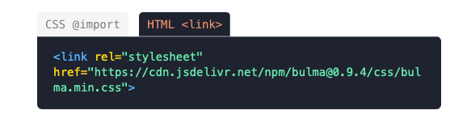

# alura-tracker

Projeto em VUE.JS versão 3, realizado como exercício do curso de VUE.JS da Alura

## Criação e primeira execução do projeto
```
vue create alura-tracker

cd alura-tracker

npm run serve
```

## Instalação e Configuração do Bulma e FontAwsome

Para o uso do Bulma

Visitando https://bulma.io/documentation/overview/start/

Copiando  para o head do index.html


Para o uso do FontAwnsome

executar o comando 
```
npm i --save-dev @fortawesome/fontawesome-free
```

import no arquivo main.ts
```
import '@fortawesome/fontawesome-free/css/all.css'
```


## Primeiro componente

Estado do componente é definido pela função interna data()

Valores calculados devem ser definidos dentro do atributo computed()

Todos os métodos do componente devem ser definidos dentro do atributo methods
